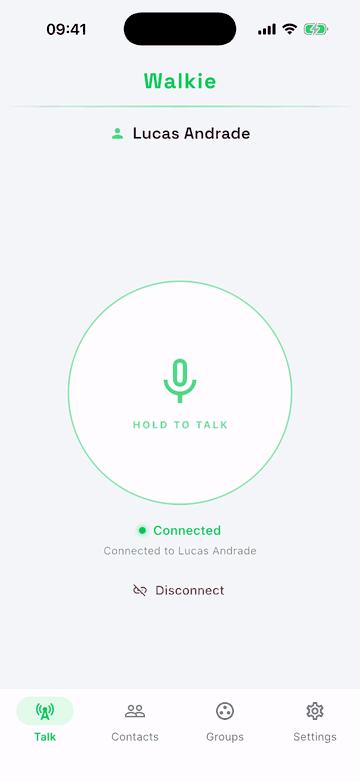
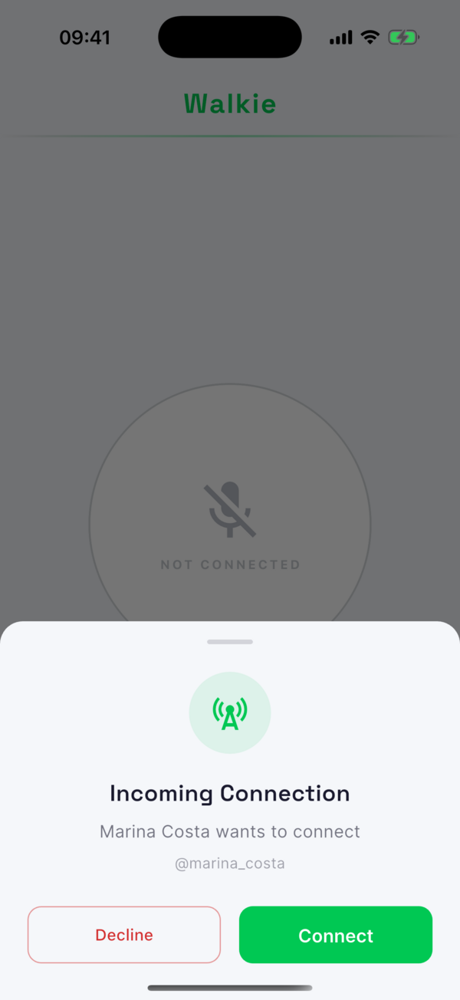
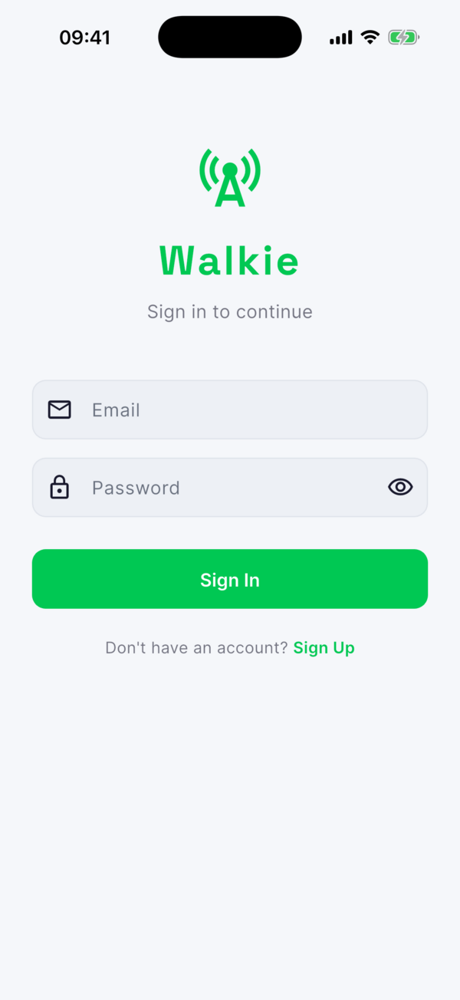

# Walkie — Push-to-Talk Voice App

Real-time push-to-talk for Android and iOS: hold the button, talk, and your contact or group hears you instantly. Built with Flutter, LiveKit (WebRTC) and Supabase, and developed end-to-end with AI coding agents (Claude Code).

<p align="center">
  
  &nbsp;&nbsp;
  
  &nbsp;&nbsp;
  
</p>

<p align="center"><a href="docs/media/push-to-talk-demo.mp4">▶ Watch the full demo (17 s)</a></p>

## Highlights

- **Push-to-talk over WebRTC** — direct (1:1) and group rooms on LiveKit. Every participant joins muted and the microphone opens only while the button is held, with echo cancellation, noise suppression and speech-optimized audio.
- **Real-time signaling** — connection requests travel over Supabase Realtime broadcast channels, so the other person gets an "Incoming connection" sheet to accept or decline. Online status uses Realtime Presence.
- **Contacts and groups** — find people by username or 6-digit Walkie ID, send contact requests, and create or join groups.
- **Keeps talking in the background** — a foreground service (`flutter_foreground_task`) keeps the audio session alive when the app is minimized.
- **No secrets in the app** — LiveKit room tokens are issued by a Supabase Edge Function that checks the user's session. The LiveKit API secret lives only in the function's environment.
- **Data protected by RLS** — Row Level Security on all 7 tables (profiles, contacts, requests, groups, members, active connections and call history). Profiles are created automatically by a database trigger at sign-up.
- **Light and dark themes**, following the system or set by the user.

## Tech stack

Flutter · Dart · LiveKit (WebRTC) · Supabase (Auth, PostgreSQL, Realtime, Edge Functions) · Provider · flutter_foreground_task

## Architecture

- **Layered app** — `services/` (LiveKit, connection, presence, call notifications, database, background audio), `providers/` (state with Provider) and `screens/` + `widgets/` (UI). Implementations can be swapped without touching the other layers.
- **Token flow** — the app calls the `live-kit` Edge Function with the room name; the function verifies the session with `supabase.auth.getUser()`, signs a short-lived LiveKit token and returns it with the server URL.
- **Gateway note** — the project signs sessions with ES256 keys, which Supabase's gateway-level JWT check doesn't support, so the function has `verify_jwt = false` and authenticates the caller itself (see [`supabase/config.toml`](supabase/config.toml)).

## How it was built

A personal project, implemented with AI coding agents (Claude Code) under my direction. I defined the product and the app's layered architecture, and validated every feature on a real device. The last iteration moved LiveKit token signing out of the app and into the Edge Function, so no secret ships inside the binary.

## Running locally

Requirements: Flutter 3.x, a Supabase project and a LiveKit Cloud project.

```bash
git clone https://github.com/AntonioPignataro/walkie.git
cd walkie
flutter pub get
```

1. **Database** — run [`supabase/setup.sql`](supabase/setup.sql) in the Supabase SQL editor.
2. **Edge Function** — deploy it and set its secrets (see [`supabase/functions/.env.example`](supabase/functions/.env.example)):
   ```bash
   supabase functions deploy live-kit
   supabase secrets set LIVEKIT_URL=... LIVEKIT_API_KEY=... LIVEKIT_API_SECRET=...
   ```
3. **App** — copy the config and run:
   ```bash
   cp config.example.json config.json   # fill in SUPABASE_URL and SUPABASE_ANON_KEY
   flutter run --dart-define-from-file=config.json
   ```

---

Built by **Antonio Pignataro** · [LinkedIn](https://www.linkedin.com/in/antoniopignataro)
